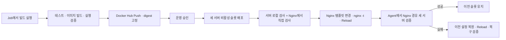

# 김동욱 Jenkins / Ansible CI/CD 실습

FastAPI 앱을 Jenkins에서 빌드·테스트하고 Docker Hub에 게시한 뒤, Ansible로 App 서버 3대와 Nginx를 관리하는 실습이다. 이 문서에 1주차 기본 구성과 2주차 블루그린 배포·검증 내용을 함께 정리한다.

| 구분 | 학습 내용 | 코드 기준 |
| --- | --- | --- |
| 1주차 | Jenkins CI/CD, 이미지 digest 배포, 서버별 컨테이너 순차 교체 | `df7c9f9` 커밋의 기본 구성 |
| 2주차 | Blue-Green, Nginx 트래픽 전환, 실패 복구, 지속 HTTP 관측 | 현재 작업 코드 |

현재 실행 방법은 **2주차 구성 기준**이다. 아래의 1주차 설명은 이전 구성 기록이며, 수동 버전 입력과 단일 포트 교체 방식은 현재 Pipeline에 적용되지 않는다. 별도 안내가 없는 명령의 실행 위치는 `practice/dongwook/`이다.

- [공통 환경](#공통-환경)
- [디렉터리](#디렉터리)
- [1주차 기본 배포](#1주차-기본-배포)
- [2주차 블루그린 배포](#2주차-블루그린-배포)
- [실행과 확인](#실행과-확인)
- [요구사항 검토와 검증 결과](#요구사항-검토와-검증-결과)
- [실서버 검증 절차](#실서버-검증-절차)
- [실행 결과 기록](#실행-결과-기록)
- [공유 환경 운영과 정리](#공유-환경-운영과-정리)

## 공통 환경

| 서버 | Public IP | 역할 |
| --- | --- | --- |
| VM 1 | `1.201.117.194` | Jenkins Controller |
| VM 2 | `1.201.116.180` | Jenkins Agent + Ansible Control Node |
| VM 3 | `1.201.116.156` | Nginx Load Balancer |
| VM 4 | `1.201.118.202` | App Server 1 |
| VM 5 | `1.201.118.10` | App Server 2 |
| VM 6 | `1.201.118.90` | App Server 3 |

| 항목 | 값 |
| --- | --- |
| Jenkins Folder / Pipeline Job | `dongwook/deploy-pipeline` |
| Agent label | `ansible-agent` |
| Nginx 서비스 포트 | `18003` |
| Blue / Green 호스트 포트 | `20003` / `21003` |
| 컨테이너 내부 포트 | `8080` |
| 슬롯별 컨테이너 | `dongwook-app-blue`, `dongwook-app-green` |
| 기존 컨테이너 | `dongwook-app` — 초기 blue 슬롯으로 취급 |
| Nginx 설정 / upstream | `/etc/nginx/conf.d/dongwook.conf` / `dongwook_backend` |
| 설정 백업 | `/etc/nginx/conf.d/dongwook.conf.previous` |
| Docker Hub 이미지 | `<Docker Hub ID>/dongwook-app:git-<commit 12자리>-<build 번호>` |

외부 요청은 Nginx `18003`으로 들어온다. Nginx에서 **세 App 서버의 두 포트 모두**에 접속 가능해야 한다. App 서버에는 두 컨테이너를 동시에 실행할 여유 자원이 필요하다.

### 앱 응답과 버전 정보

앱 로직은 `app/main.py` 하나이며 별도 업무 API나 DB는 없다. `/`와 `/version`은 다음 정보를 반환하고, `/health`에는 `status: ok`가 추가된다. 응답에는 `Cache-Control: no-store`를 지정한다.

```json
{
  "service": "dongwook-app",
  "version": "git-abcdef123456",
  "release": "git-abcdef123456-42",
  "revision": "abcdef1234567890abcdef1234567890abcdef1234",
  "instance": "dongwook_app1",
  "hostname": "f3a12b4c5d6e",
  "slot": "green"
}
```

| 필드 | 설정 시점 | 용도 |
| --- | --- | --- |
| `version` | 빌드 시 `APP_VERSION` | 1주차는 입력한 `v1`/`v2`, 2주차는 Git 커밋 기반 버전 |
| `release` | 빌드 시 `RELEASE_ID` | 같은 커밋을 재빌드해도 빌드별로 식별 |
| `revision` | 빌드 시 `GIT_REVISION` | 이미지에 포함된 전체 Git 커밋 SHA |
| `instance` | 실행 시 `INSTANCE_ID` | 실제 응답한 App 서버 |
| `hostname` | 컨테이너 hostname | 컨테이너 재생성 여부 구분 |
| `slot` | 실행 시 `DEPLOYMENT_SLOT` | 1주차는 `primary`, 2주차는 `blue` 또는 `green` |

버전·release·커밋은 이미지에 포함하고 서버·슬롯은 실행 시 주입하므로 동일 이미지를 다른 서버나 슬롯에서 재사용할 수 있다. 실제 배포 대상은 태그를 다시 해석하지 않고 게시한 digest로 고정한다.

현재 health는 앱 프로세스 응답을 확인한다. DB 등 외부 의존성을 추가하면 서비스 준비 상태도 확인하도록 확장하고, 이전·신규 앱이 동시에 동작할 수 있는 스키마 변경을 설계해야 한다.

## 디렉터리

```text
practice/dongwook/
├── README.md                          # 1·2주차 구성과 검증 기록
├── Jenkinsfile                        # CI, 운영 승인 배포, 지속 HTTP 관측
├── .gitignore                         # 키, 환경변수, 임시 산출물 제외
├── app/
│   ├── Dockerfile
│   ├── main.py                        # /, /health, /version
│   ├── requirements.txt
│   └── tests/test_main.py
├── ansible/
│   ├── ansible.cfg
│   ├── inventory/
│   │   ├── hosts.yml                  # App 3대 + Nginx
│   │   └── group_vars/all.yml         # 개인 리소스, 슬롯과 포트
│   ├── playbooks/deploy.yml           # 슬롯 발견 → 후보 배포 → 전환
│   └── roles/
│       ├── app/tasks/main.yml         # 비활성 슬롯 배포, legacy 전환
│       └── nginx/
│           ├── tasks/discover.yml    # 기존 설정·실행 상태와 활성 슬롯 검사
│           ├── tasks/main.yml        # 후보 검사, 설정 전환·복구
│           ├── handlers/main.yml     # Reload 및 실행 결과 전달
│           └── templates/dongwook.conf.j2
└── scripts/
    ├── test-image.sh                  # 테스트 컨테이너 실행·HTTP 검사·정리
    ├── write-deploy-vars.py           # digest와 빌드 정보를 JSON으로 저장
    ├── deployment_state.py            # 기존 upstream에서 다음 슬롯 결정
    ├── verify.py                      # Nginx 경유 release·세 instance 검사
    ├── monitor_deployment.py          # 배포 중 성공률·트래픽 전환 기록
    └── tests/                         # 배포 보조 로직 테스트
```

`.artifacts/`는 실행 중 생성되며 Git에 포함하지 않는다. Jenkins Script Path는 `practice/dongwook/Jenkinsfile`이다.

## 1주차 기본 배포

1주차는 Jenkins에서 이미지를 빌드·검증하고, Ansible로 세 서버에 같은 이미지를 배포하는 기본 CI/CD를 구성했다. 당시에는 일반 Pipeline Job을 사용했다.

| 항목 | 1주차 구성 |
| --- | --- |
| 버전 지정 | **Build with Parameters**에서 `APP_VERSION` 입력, 기본 `v1` |
| release / 이미지 태그 | `<APP_VERSION>-<commit 12자리>-<build 번호>` |
| 컨테이너 / 슬롯 | 서버별 `dongwook-app` 하나, `DEPLOYMENT_SLOT=primary` |
| 호스트 포트 | `20003` 사용, `21003` 예약 |
| 배포 방식 | `serial: 1`로 기존 컨테이너를 삭제한 뒤 새 컨테이너 실행 |
| 트래픽 전환·복구 | blue/green 동시 실행과 자동 롤백 미구현 |

1. Agent가 소스를 체크아웃하고 입력한 버전·Git 커밋·빌드 번호로 release를 생성한다.
2. Python 테스트를 실행하고 이미지를 한 번 빌드한다. `test-image.sh`가 호스트 포트 없이 테스트 컨테이너를 실행해 `/health`, `/version`과 빌드 정보를 검사한다.
3. `dockerhub-credentials`로 Docker Hub에 Push하고 `write-deploy-vars.py`로 digest와 배포 정보를 저장한다. Private Repository도 같은 Credential로 지원한다.
4. Ansible이 digest로 이미지를 Pull하고 서버별 `dongwook-app`을 순차 교체한다. 각 서버의 로컬 health와 release를 검사한다.
5. 세 서버 배포 후 Nginx 개인 설정을 반영하고, 설정이 바뀌면 `nginx -t` 후 Reload한다.
6. Agent가 Nginx 경유 응답을 검사하고 `deploy-vars.json`을 Jenkins Artifact로 보관한다.

당시 Stage는 `CI: Checkout → Python Test → Build Image → Test Image`, `CD: Push Image → Deploy App + Nginx → Verify`였다. 모든 단계는 같은 Agent와 Workspace를 사용했다.

기존 컨테이너를 먼저 삭제하기 때문에 요청 중단 가능성이 있고, 배포 실패 시 일부 서버에 이전 버전이 남을 수 있었다. 2주차에서는 두 슬롯을 동시에 실행하고 검증 후 트래픽을 바꾸는 방식으로 확장했다. 1주차 파일은 `git show df7c9f9:practice/dongwook/Jenkinsfile`처럼 해당 커밋에서 확인할 수 있다.

## 2주차 블루그린 배포

앱 서버 3대각각에 `blue=20003`, `green=21003` 슬롯을 둔다. Jenkins는 Git 커밋에서 버전을 자동 생성하고, 테스트한 이미지의 digest를 비활성 슬롯에 배포한다. 세 서버의 헬스체크와 버전 검증이 모두 통과하면 Nginx upstream 3개를 새 슬롯으로 함께 변경하고 Reload한다.

현재 `20003`으로 서비스 중이므로 첫 배포는 green이다. 그 다음은 blue로 배포한다. 색상은 고정된 포트 이름이며, 활성/비활성 역할이 배포마다 바뀐다.



### Jenkins 운영 흐름

버전 입력 파라미터를 제거했다. 예를 들어 Job의 SCM 설정에서 체크아웃한 커밋이 `abcdef123456...`, Jenkins 빌드 번호가 `42`이면 다음과 같다.

- `APP_VERSION`: `git-abcdef123456`
- `RELEASE_ID`: `git-abcdef123456-42`
- `GIT_REVISION`: 전체 Git 커밋 SHA
- 배포 이미지: `<Docker Hub ID>/dongwook-app@sha256:...`

일반 Pipeline Job의 **Build Now** 또는 설정된 트리거로 실행한다. Job에 지정한 SCM 브랜치를 체크아웃해 CI를 수행하고, 성공하면 이미지를 Push한 뒤 승인 대기한다. 승인 화면에서 release와 Artifact의 `deploy-vars.json`을 확인한다. 승인한 이미지를 재빌드하지 않고 같은 digest로 배포한다. 승인을 취소하거나 15분 내 승인하지 않으면 서버를 변경하지 않는다. 이미지 자체는 이미 Registry에 게시된 상태다.

`CI`: Checkout → Python Test → Validate Ansible → Build Image → Test Image

`CD`: Push Image → Approve Production → 지속 HTTP 관측과 함께 Deploy Blue Green → 관측 결과 판정

#### Jenkins 설정

1. 기존 **Pipeline** Job에서 Definition을 `Pipeline script from SCM`으로 설정하고 저장소와 SCM Credential을 지정한다. Script Path는 `practice/dongwook/Jenkinsfile`이다.
2. Job의 **Branches to build / Branch Specifier**에 실제 배포할 브랜치를 지정한다. `checkout scm`은 이 설정의 커밋을 빌드한다. Jenkinsfile은 브랜치 이름을 판별하지 않으므로, Job이 다른 브랜치를 체크아웃하면 그 코드도 CI 통과와 운영 승인 후 배포 대상이 된다.
3. Pipeline, Git, Credentials Binding 플러그인을 준비한다.
4. `dockerhub-credentials`에 Docker Hub ID와 토큰을 등록한다. Agent에는 Python 3, Docker CLI/엔진, Ansible이 필요하다. Agent 계정의 SSH 키·설정·`known_hosts`로 App 서버와 Nginx에 접속하고, 원격 배포 계정은 비밀번호 없이 sudo가 가능해야 한다.
5. 운영 승인 권한은 Jenkins Folder/Job 권한으로 제한한다. 이 Job은 신뢰할 수 있는 배포 브랜치와 Agent를 전제로 한다. 외부 PR 코드를 실행하는 CI는 운영 SSH 키가 없는 별도 Job/Agent에서 수행한다.

### 배포 순서와 기존 서비스 전환

1. Nginx의 기존 설정을 읽어 `dongwook_backend`의 세 IP가 모두 같은 `20003` 또는 `21003`을 사용하는지 확인한다. 설정이 없거나 혼합 포트·다른 서버가 있으면 배포를 중단한다. 이 Playbook은 현재 서비스의 전환용이며 초기 서버 설치용이 아니다.
2. Nginx의 실제 응답과 설정 파일의 슬롯이 일치하는지 검사한다. Agent에서도 이전 release가 세 서버의 `/health`, `/version`에 모두 나타나는지 확인한다. 이전 실패로 설정 파일과 실행 상태가 어긋났다면 먼저 이를 복구해야 한다.
3. 세 서버에 순서대로 비활성 슬롯 컨테이너를 생성한다. 기존 활성 슬롯은 계속 서비스한다. 비활성 컨테이너 교체 전 `owner=dongwook`, 슬롯 라벨과 할당 포트를 검사한다.
4. 각 서버의 로컬 `/health`, `/version`에서 release·commit·instance·slot을 검사한다. 한 서버라도 실패하면 이후 트래픽 전환을 진행하지 않는다.
5. 세 서버가 모두 통과한 사실을 확인한 뒤, Nginx 서버에서도 새 포트의 `/health`, `/version`을 각각 호출한다. 이 단계에서 LB와 App 사이 방화벽 문제도 확인한다.
6. 기존 설정을 `.previous` 파일로 보관하고 새 템플릿을 적용한다. 템플릿이 변경되고 `nginx -t`가 성공하면 `Reload Dongwook Nginx` Handler를 notify하고, `meta: flush_handlers`로 즉시 실행한다. Handler의 실행 결과를 바로 assert하여 실패를 일반 Task 실패로 전달하므로 기존 `block/rescue`에서 복구한다. Handler의 `ignore_errors`는 이 결과 전달 용도이며, 실패를 배포 성공으로 처리하지 않는다. discovery 이후 설정 파일이 변경되었다면 덮어쓰지 않고 중단한다.
7. Agent가 실제 Nginx 주소로 반복 요청하여 `/health`, `/version` 각각에서 세 instance를 모두 관측하고 새 release·commit·slot을 확인한다. 검증 실패 또는 설정 검사·Reload 실패 시 원래 설정을 복원하고 Reload한 뒤 이전 release를 검증한다. 복구에 성공해도 Jenkins 빌드는 실패로 남긴다.
8. 성공 후에도 이전 슬롯 컨테이너는 유지한다. 다음 배포가 그 비활성 슬롯을 재사용할 때 교체한다.

최초 전환에서는 기존 `dongwook-app`의 `slot=primary`를 blue로 인정하고 그대로 둔다. 이후 green이 활성화된 상태에서 blue로 배포할 때만 기존 컨테이너의 소유권과 `20003` 포트를 확인하고 삭제한 뒤 `dongwook-app-blue`를 생성한다.

Nginx Reload는 새 worker가 신규 연결을 받게 하고 기존 worker의 요청은 마무리하게 한다. 이전 컨테이너를 즉시 삭제하지 않는 이유다. 이 예제의 요청은 짧은 HTTP 응답이다. 장기 연결이 있는 서비스로 확장할 때에는 다음 배포에서 이전 슬롯을 재사용하기 전 연결 종료 대기도 추가해야 한다. [Nginx 공식 동작 설명](https://nginx.org/en/docs/control.html)

#### 실패와 복구 범위

| 실패 지점 | 동작 |
| --- | --- |
| 이미지 Pull / 컨테이너 실행 / 후보 health·version 검사 | 기존 트래픽 유지, 빌드 실패. 일부 비활성 슬롯에 새 이미지가 남을 수 있음 |
| Nginx 설정 검사 / Reload / 전환 후 HTTP 검증 | 이전 설정 복원 → 검사 → Reload → 이전 release 확인 → 빌드 실패 |
| SSH 단절 / Jenkins 강제 종료 / 복구 자체 실패 | 자동 복구 완료를 보장하지 않음. 설정 파일·실제 응답 확인 후 수동 복구 필요 |

Ansible의 `rescue`는 일반 Task 실패에 대응하며, unreachable 호스트나 프로세스 강제 종료를 복구해 주지는 않는다. [Ansible Blocks 문서](https://docs.ansible.com/projects/ansible-core/devel/playbook_guide/playbooks_blocks.html)

수동 복구 시에는 실행 중인 배포를 먼저 멈추고 `.previous`의 대상 포트와 세 서버 응답을 확인한다. **다음 배포가 이전 슬롯을 재사용하기 시작했다면 `.previous`가 가리키는 컨테이너가 이미 교체되었을 수 있다.** 이전 release가 세 서버에 그대로 남아 있을 때만 해당 설정을 복원하고 `nginx -t` → Reload → Agent 검증을 진행한다. 컨테이너가 교체됐다면 Jenkins Artifact에 보관한 이전 digest로 재배포한다. 배포 후 모든 Artifact의 release와 실제 `/version`을 대조할 수 있다.

### 지속 요청으로 무중단 배포 검증

Jenkins의 실제 `ansible-playbook` 명령을 `scripts/monitor_deployment.py`로 감싼다. 배포 프로세스와 별도로 HTTP 요청을 반복하므로 후보 컨테이너 생성·Nginx Reload·실패 복구 과정에도 관측이 계속된다.

- 배포 전: `/health` 15회 관측. 세 서버가 동일한 기존 release로 정상 응답해야 배포 명령을 실행한다.
- 배포 중: 요청 완료 후 기본 0.2초 간격으로 `/health` 요청. 각 요청의 제한 시간은 2초다. 응답 지연이 있으면 실제 요청 간격은 늘어난다.
- 배포 후: 명령 종료 후 5초간 추가 관측. 신규 release가 모든 서버에서 관측되고 마지막 구간은 새 슬롯으로 응답해야 성공이다.
- 성공 판정: 배포 명령 종료 코드 0, 이전/신규 release 전환 확인, 신규 세 서버 관측, 실패 요청 0건. 한 번의 HTTP 오류나 잘못된 응답도 이후 성공으로 지우지 않는다.

Jenkins Artifact에 다음 증거가 남는다. 성공·실패 빌드 모두 `post { always }`에서 보관하며, 다음 빌드 시작 시 이전 측정 파일을 정리한다.

| Artifact | 내용 |
| --- | --- |
| `deploy-vars.json` | 배포할 이미지 digest와 Git 버전·release |
| `availability/requests.jsonl` | 매 요청의 UTC 시간, 경과 시간, 단계, HTTP 상태, 지연, 버전, release, commit, instance, slot, hostname, 오류 |
| `availability/summary.json` | 전체/단계별 요청 성공률, 실패 건수, p95 지연, 서버별 트래픽, 버전·슬롯 전환 순서, 판정 조건 |

`availability_pct`는 **정상 health 응답이며 이전/신규 release·예상 서버와 일치한 요청 수 / 총 요청 수 × 100**이다. HTTP 200이지만 잘못된 버전/서버 또는 비정상 JSON이면 실패다. `http_200_pct`도 별도로 기록한다. 이는 샘플 요청 기반 관측값이며 요청 사이의 모든 순간이나 전체 사용자 트래픽의 가용성을 증명하는 수치는 아니다.

Ansible의 Reload/전환 검증 실패는 `block/rescue`에서 자동 복구한다. 지속 요청 도구가 중간 오류를 관측했지만 Ansible은 최종 검증에 성공한 경우에는 **Jenkins를 실패 처리하고 측정 증거를 남기며, 현재 정상인 새 슬롯을 추가로 되돌리지는 않는다.** 배포 실패 후 기존 슬롯이 100% 정상 응답하더라도 해당 배포의 결과는 실패로 기록한다.

요구사항의 `v1 → v2`는 이전·신규 애플리케이션 버전을 의미한다. 1주차의 `v1`에서 첫 Git 버전으로 전환하거나, Job에 설정한 배포 브랜치에 서로 다른 두 커밋을 반영해 `git-<커밋 A> → git-<커밋 B>`로 검증한다. 같은 커밋을 재빌드하면 release만 달라지므로 과제의 버전 전환 증거에는 다른 커밋을 사용한다. 원시 로그의 `instance`는 실제 응답한 서버이며, `slot`과 `release`로 전환 전후를 구별한다.

Jenkins 외부에서 실행해야 한다면 Agent에서 기존 Registry 환경변수를 준비하고, 다른 배포가 없는 상태에서 다음과 같이 실행한다.

```bash
export ANSIBLE_CONFIG="$PWD/ansible/ansible.cfg"
python3 scripts/monitor_deployment.py \
  --expected-file .artifacts/deploy-vars.json \
  --output-dir .artifacts/availability \
  -- ansible-playbook -i ansible/inventory/hosts.yml \
      ansible/playbooks/deploy.yml --extra-vars @.artifacts/deploy-vars.json
```

실서버 실행·실패 주입 시나리오와 기록 양식은 [실서버 검증 절차](#실서버-검증-절차)에 있다. 로컬 보조 로직 테스트 통과와 실제 서버의 무중단 배포 검증은 구분한다.

## 실행과 확인

```bash
# 추가 의존성 없이 배포 보조 로직 검사
python3 -m unittest discover -s scripts/tests -v

# 기존 앱 테스트
python3 -m venv .venv
.venv/bin/python -m pip install -r app/requirements.txt
(cd app && ../.venv/bin/python -m unittest discover -s tests -v)

# Ansible 설치된 Agent에서 실행 — 대상 서버 변경 없음
export ANSIBLE_CONFIG="$PWD/ansible/ansible.cfg"
ansible-inventory -i ansible/inventory/hosts.yml --graph
ansible-playbook -i ansible/inventory/hosts.yml ansible/playbooks/deploy.yml --list-hosts
ansible-playbook -i ansible/inventory/hosts.yml ansible/playbooks/deploy.yml --syntax-check
```

실제 배포에는 Jenkins가 생성한 `.artifacts/deploy-vars.json`과 Registry Credential 환경변수가 필요하다. 배포 Playbook에 `--limit`, `--check`, 일부 Task만 실행하는 옵션은 사용하지 않는다. 세 서버 검증과 트래픽 전환을 하나의 실행으로 유지한다.

```bash
curl --fail http://1.201.116.156:18003/health
curl --fail http://1.201.116.156:18003/version

# 실제 Artifact 값으로 변경. 최초 전환 후 slot은 green.
python3 scripts/verify.py \
  --version git-abcdef123456 --release git-abcdef123456-42 \
  --revision '<전체 Git SHA>' --slot green \
  --instances dongwook_app1 dongwook_app2 dongwook_app3
```

로컬에서 앱을 실행하려면 별도 터미널에서 다음 명령을 사용한다. 개발 서버는 `Ctrl+C`로 종료한다.

```bash
APP_VERSION=local .venv/bin/python -m uvicorn main:app --app-dir app --port 8080
```

`--list-hosts`에는 App 서버 3대와 Nginx 서버 1대가 나타나야 한다. Jenkins의 `Validate Ansible` Stage도 같은 문법 검사를 수행한다.

## 요구사항 검토와 검증 결과

검토일: 2026-10-09. **구현과 로컬 보조 로직 검증은 완료했지만, 실서버 무중단 배포 검증은 아직 완료하지 않았다.**

### 2주차 요구사항별 판정

| 요구사항 | 구현 근거 | 검증 상태 |
| --- | --- | --- |
| Rolling / Canary / Blue-Green 중 선택 | Blue-Green, blue=20003 / green=21003 | 슬롯 선택 로직 테스트 통과 |
| 전략에 맞는 Jenkins·Ansible 구성 | Git 버전·digest 고정 → 활성 슬롯 발견 → 비활성 슬롯 배포 → 전체 검증 → 전환 | 코드 검토·정적 검사 완료, Jenkins/Ansible 실행 확인 필요 |
| Nginx 트래픽 분산·제어 | 세 서버의 동일한 후보 포트로 upstream 구성, 설정 검사 후 Reload | 두 슬롯 템플릿 렌더링 확인, 실서버 전환 확인 필요 |
| 배포 전후 Health Check | 기존 release 검사, 후보별 로컬/LB 검사, 전환 후 Agent의 두 endpoint 검사 | 응답 검증 보조 로직 테스트 통과 |
| 배포 실패 시 후속 배포 중단 | `serial: 1`, `any_errors_fatal: true`, 후보 세 서버 완료 검사, 복구 후 명시적 실패 | 코드 검토 완료, 원격 실패 주입 검증 필요 |
| Role·Handler·Variable 사용 | `app`/`nginx` Role, Reload Handler, `group_vars`와 슬롯·release 변수 | 구조와 YAML/Jinja 검사 완료, Handler 실행 검증 필요 |
| 배포 중 지속 HTTP 요청 | `monitor_deployment.py`가 배포 subprocess 실행 중 `/health` 요청 | 요청·프로세스를 대체한 로컬 테스트 통과, 실제 HTTP 관측 필요 |
| 응답 성공률·가용성 확인 | 실패 요청을 보존하고 전체/단계별 성공률 산출 | 오류·잘못된 JSON·타임아웃 집계 테스트 통과, 실제 측정값 없음 |
| 처리 서버·버전 전환 확인 | 요청별 instance·hostname·slot·version·release·revision 기록 | 이전/신규 세 서버 관측과 전환 집계 테스트 통과, 실제 Artifact 필요 |

배포 전략과 자동화 요구사항은 코드로 구성했고, 무중단 배포를 관측하고 증거를 남길 도구도 준비했다. **실제 v1→v2 전환 동안 서비스가 정상 응답했다는 최종 판정은 아래 실서버 검증 후에만 가능하다.**

### 로컬 검사 기록

- 배포 보조 로직 테스트: **27개 통과**. 슬롯 판별, 잘못된 release/slot/instance 응답 거부, 전환 후 세 서버 확인, 재시도 한도, 성공률 계산, 단일 오류 보존, baseline 실패 시 배포 미실행, 배포 명령 실패 시 보고서 실패 처리를 확인했다.
- 모든 프로젝트 Python 파일 문법, Ansible YAML 및 Jinja 표현식 파싱을 확인했다.
- blue/green Nginx 템플릿을 각각 렌더링하고 다음 슬롯 판별 결과를 확인했다.
- Jenkinsfile 내부 shell 구문의 `sh -n`과 `git diff --check`를 확인했다.

검증 환경의 도구·의존성 제약으로 **`ansible-playbook --syntax-check`, Jenkins Declarative Pipeline 검증, Docker 이미지 실행, 실제 SSH/HTTP 배포 및 기존 FastAPI 테스트는 이 검증 기록에 포함하지 않는다.** YAML/Jinja 파싱은 Ansible 실행 검증을 대체하지 않는다. 위 27개 테스트는 모의 HTTP 응답과 모의 배포 프로세스를 사용하며 실서버에 접속하지 않는다.

## 실서버 검증 절차

### 정상 전환

1. 현재 Nginx `18003`이 세 서버의 `20003`으로 연결되어 있는지 확인한다. 처음에는 `slot=primary` 응답도 정상이다. Nginx→App 세 서버의 `21003` 연결과 동시 컨테이너 실행 자원을 준비한다.
2. 이전 앱과 구별되는 새 커밋을 Job에 설정한 배포 브랜치에 반영하여 Jenkins CI를 통과시킨다. 승인 화면의 release와 `deploy-vars.json` digest를 확인하고 배포를 승인한다.
3. 배포 단계에서 HTTP 관측이 먼저 시작되고, 이전 release가 세 서버에서 관측된 뒤에만 후보 배포가 시작되는지 로그를 확인한다.
4. Artifact `availability/summary.json`에서 `passed=true`, `failures=0`, `availability_pct=100`, `command_returncode=0`을 확인한다. 버전 전환 과제의 증거에는 `display_version_changed=true`도 필요하다.
5. `by_phase`의 `before`·`during`·`after` 모두 요청이 기록되었는지 확인한다. `traffic`에 이전 슬롯과 신규 슬롯의 세 instance가 모두 나타나는지, `transitions`에 이전/신규 release가 나타나는지 확인한다.
6. `availability/requests.jsonl`에서 전환 시각 주변의 HTTP 상태, instance, slot, release를 확인한다. 기존 요청이 마무리되는 동안 이전/신규 응답이 잠깐 섞일 수 있지만 최종 구간에는 신규 슬롯만 나타나야 한다.
7. 다른 새 커밋으로 다시 배포하여 green→blue 전환도 같은 방식으로 확인한다. 첫 green 전환 이후의 blue 배포에서만 legacy `dongwook-app`을 교체하는지 확인한다.

### 실패 시나리오

실패 주입은 별도 검증 환경에서 수행한다. 공유 운영 Nginx 설정이나 활성 컨테이너를 고의로 손상시키지 않는다. 테스트 후에는 주입한 조건을 제거한다.

| 시나리오 | 주입 위치 | 기대 결과 |
| --- | --- | --- |
| 기존 서비스 비정상 | 관측 baseline에 HTTP 오류/서버 누락 | 배포 명령 미실행, `command_started=false`, 보고서 실패 |
| 후보 앱 실패 | 신규 이미지의 `/health`가 503 응답 | 후보 검사 실패, 이후 서버 배포·Nginx 전환 중단, 기존 release 유지 |
| LB 경로 실패 | 검증 환경에서 Nginx→후보 포트만 차단 | 서버 로컬 검사는 통과할 수 있으나 LB 검사 실패, 전환 없음 |
| 설정 검사 실패 | 검증 환경의 후보 Nginx 템플릿에 문법 오류 | Reload Handler 미실행, 이전 설정 복원 후 실패 종료 |
| Reload 실패 | 검증 환경의 Reload 실행을 실패하게 구성 | Handler 결과 assert 실패 → 이전 설정 복원·재검사·Reload, 복구 자체 실패 시 성공으로 표시하지 않음 |
| 전환 후 응답 검증 실패 | 후보 직접 검사는 정상이나 전환 후 Agent 응답이 잘못된 release | 이전 설정 복원·Reload·이전 release 검증, Jenkins 실패 |
| 관측 중 단발 HTTP 실패 | 전환은 완료되지만 관측 요청 1회 실패 | 누락 없이 실패율에 반영, Jenkins 실패. 최종 정상 슬롯의 추가 롤백은 하지 않음 |

실패 배포에서 기존 트래픽이 유지되어 요청 성공률이 100%여도 배포 결과 자체는 실패여야 한다. 실패로 `serial: 1`의 다음 서버가 실행되지 않는지 Ansible 로그로 확인한다. SSH 단절·프로세스 강제 종료는 `rescue`만으로 자동 복구를 보장하지 않으므로 별도 운영 복구가 필요하다.

## 실행 결과 기록

아래 값은 아직 측정하지 않았으며 성공 사례를 임의로 채우지 않았다.

| 항목 | 첫 blue→green | 다음 green→blue |
| --- | --- | --- |
| Jenkins Build URL | 미실행 | 미실행 |
| 이전 → 신규 version / release | 미측정 | 미측정 |
| 신규 이미지 digest | 미측정 | 미측정 |
| 관측 시작/종료 시각 | 미측정 | 미측정 |
| 총 요청 / 정상 응답 / 실패 | 미측정 | 미측정 |
| 배포 중 요청 수 / 성공률 | 미측정 | 미측정 |
| 이전·신규 세 instance 관측 | 미확인 | 미확인 |
| 최종 슬롯·release | 미확인 | 미확인 |
| JSONL / summary Artifact 링크 | 없음 | 없음 |
| 실패·복구 시나리오 결과 | 미실행 | 미실행 |

## 공유 환경 운영과 정리

- 자신의 Folder, Workspace, `dongwook-` 리소스와 할당 포트만 사용한다. Controller와 Agent는 앱 배포 대상이 아니다.
- 시스템 패키지 설치, Docker 재시작, 서버 재부팅과 다른 사용자의 설정 변경은 자동화하지 않는다.
- SSH는 Agent 실행 계정의 키·설정·`known_hosts`를 사용하고 호스트 키 확인을 유지한다. 대상 서버의 `authorized_keys`에 공개키가 등록되어 있어야 한다. 별도 SSH 키/known_hosts Jenkins Credential은 사용하지 않는다.
- App 서버와 Nginx 서버에서는 `become`으로 root 권한을 사용한다. sudo 비밀번호를 주입하지 않으므로 배포 계정에 비밀번호 없는 sudo 권한이 필요하다.
- Docker Hub 토큰은 `--password-stdin`으로 전달한다. Agent와 원격 서버에 전용 임시 Docker 설정을 만들고 정리하며, 공통 `~/.docker/config.json`을 수정하거나 인증 파일을 Artifact로 보관하지 않는다.
- Nginx는 개인 파일 `/etc/nginx/conf.d/dongwook.conf`를 관리한다. 이전 설정은 `.previous`에 보관한다.
- 이전 슬롯 컨테이너와 원격 이미지는 다음 배포·복구를 위해 유지한다. `docker system prune`이나 전체 컨테이너 삭제 명령은 사용하지 않는다.

실습 종료 시 실행 중인 배포가 없는지 확인하고, 자신의 Nginx 트래픽을 먼저 해제한다. 개인 설정을 제거할 때도 `/etc/nginx/conf.d/dongwook.conf`만 제거하고 `nginx -t` 후 Reload한다.

각 App 서버에서는 컨테이너의 소유권과 실제 사용 여부를 확인한다.

```bash
docker ps -a --filter name=dongwook-app
docker inspect dongwook-app-blue --format '{{json .Config.Labels}}'
docker inspect dongwook-app-green --format '{{json .Config.Labels}}'
# 기존 컨테이너가 남아 있으면 함께 확인
docker inspect dongwook-app --format '{{json .Config.Labels}}'

# 트래픽 해제와 owner=dongwook 확인 후, 존재하는 본인 컨테이너만 지정
docker rm -f '<확인한 컨테이너 이름>'
docker image ls --digests '<Docker Hub ID>/dongwook-app'
docker image rm '<Docker Hub ID>/dongwook-app@sha256:<사용하지 않는 digest>'
```

## 참고 문서

- [Nginx 설정 변경과 Reload](https://nginx.org/en/docs/control.html)
- [Ansible Handler](https://docs.ansible.com/projects/ansible-core/devel/playbook_guide/playbooks_handlers.html)
- [Ansible 오류 처리와 배포 중단](https://docs.ansible.com/projects/ansible-core/2.19/playbook_guide/playbooks_error_handling.html)
