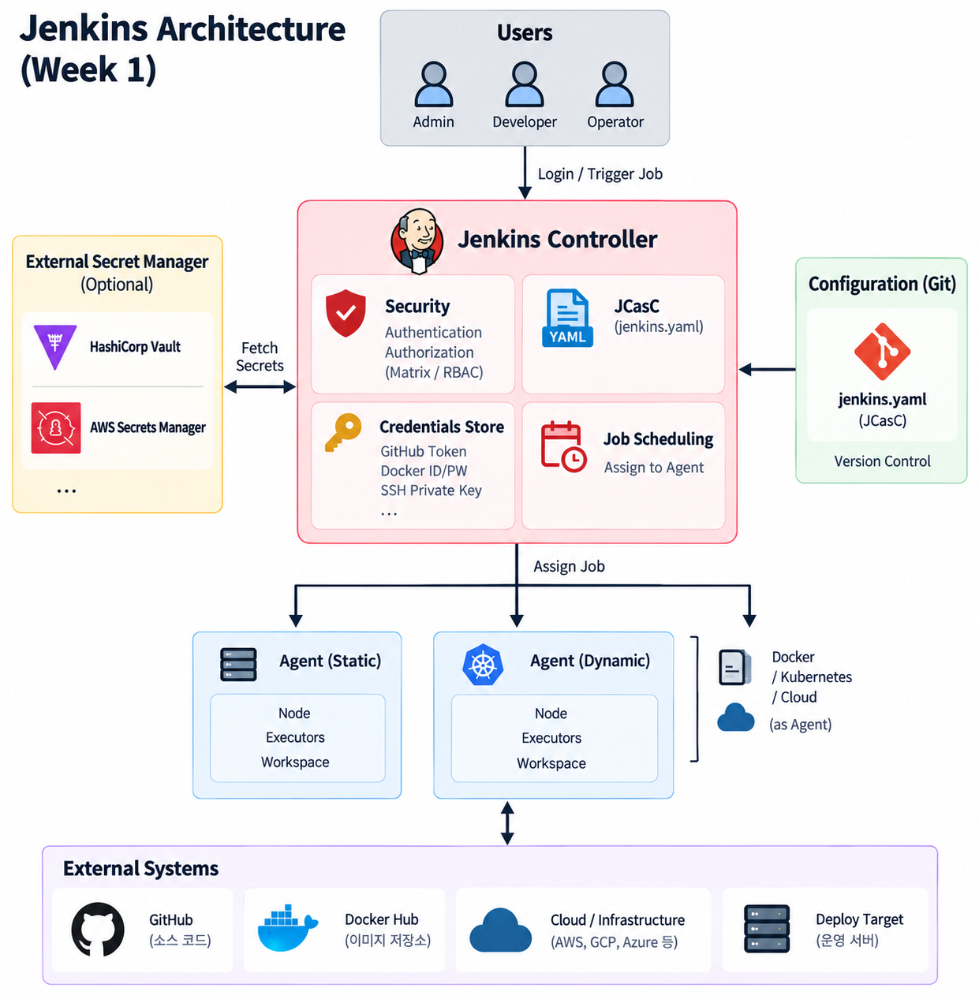

# Week 2: Jenkins 학습 정리

## Components of Distributed Builds



분산 빌드 아키텍처에서 수행되는 빌드는 node, agent, executor를  사용

---

### Jenkins controller

Jenkins 서비스 그 자체, Jenkins가 설치되어 있는 곳.

설정(configuration), 권한 부여(authorization), 인증(authentication)과 같은 관리 작업이 수행된다.

pipeline이 실행될 때 생성되는 파일들은 기본적으로 controller의 파일 시스템에 기록된다. (파일을 외부 저장소에 분리할 수도 있음)

---

### Nodes

build agent가 실행되는 “machine”. Jenkins는 node에 대해 디스크 공간, 임시 디렉토리/swap 여유 공간, 시스템 시간, 응답 시간 등을 모니터링한다.

> **💡 Node vs Agent**
>
> - **Node**: 머신 / 실행 환경
> - **Agent**: 그 머신에서 실행되는 Jenkins 프로세스

#### jenkins에서 지원하는 Node 종류

- **agents**
    - 일반적인 Jenkins agent node
- **built-in node**
    - controller 프로세스 내부에 존재하는 node
    - security, performance, scalability 면에서 실제 빌드 작업을 실행하는 것을 권장하지 않음(executor = 0)
    - executor 개수에 따라 해당 node가 동시에 몇 개의 작업을 처리할 수 있는지 결정된다.

---

### Agents

executor를 사용해서 Jenkins controller를 대신해 실제 작업 실행. Agent는 Jenkins controller에 연결되는 작은 Java client process이다. (170KB 크기의 단일 jar)

빌드와 테스트에 필요한 모든 도구는 agent가 실행되는 node에 설치되어 있어야 한다. (직접 설치 혹은 Docker나 Kubernetes 같은 컨테이너 환경 안에 설치 가능)

자기 자신의 PID를 가진 하나의 프로세스

---

### Executors

작업을 실행하기 위한 하나의 슬롯. agent 안의 하나의 thread와 유사한 역할을 한다. 동시에 실행할 수 있는 task의 수이며, 동시에 수행 가능한 pipeline stage의 수에도 영향을 준다.

#### 권장 Executors 설정

- Node당 executor 1개
- 실행하는 작업이 작다면 CPU core 하나당 executor 하나도 잘 동작할 수 있음
- 하나의 node에서 여러 executor 실행 시 모니터링 필요(I/O performance, CPU load, Memory usage, I/O throughput)

---

### Controller-Agent 연결 방식 (SSH)

Controller가 Agent를 연결하는 방법 중 하나. Controller가 **먼저 Agent 머신에 SSH로 접속**해서 agent 프로세스(`remoting.jar`)를 알아서 실행시켜준다.

- Agent 쪽에서 사람이 직접 `java -jar agent.jar`를 실행할 필요가 없음 (Inbound 방식은 반대로 Agent 쪽에서 수동 실행 필요)
- 연결 인증은 SSH Key Pair(Private/Public Key)로 함 — EC2 인스턴스 접속키와 원리 동일
  - Public Key: Agent 머신의 `~/.ssh/authorized_keys`에 등록
  - Private Key: Jenkins Credential(`SSH Username with private key`)로 등록해서 Controller가 사용
- 방화벽 때문에 Controller가 Agent에 직접 못 붙는 환경이면 Inbound 방식을 대신 씀

#### 실습 (Docker)

`jenkins/ssh-agent` 이미지로 SSH 서버 + Java가 깔린 Agent 컨테이너를 띄우고, Permanent Agent(Label: `linux`)로 등록해서 실제로 Built-in Node가 아니라 이 Agent에서 빌드가 도는 것까지 확인함. 자세한 과정은 [practice-log.md](practice-log.md) 참고.

## Using Docker with Pipeline

#### reuseNode true

새 Workspace 만들지 말고, 현재 Agent에서 쓰던 Workspace를 그대로 Docker Container에 연결해준다.

```groovy
pipeline {
    agent any

    stages {
        stage('Build') {
            agent {
                docker {
                    image 'gradle:8.14.0-jdk21-alpine'
                    reuseNode true
                }
            }

            steps {
                sh 'gradle -g gradle-user-home --version'
            }
        }
    }
}
```

#### Caching data for containers

Container가 없어져도 Agent의 `$HOME/.m2`에 남아있어 다음 Build에서도 재사용 가능하다.

```groovy
agent {
    docker {
        image 'maven:3.9.9-eclipse-temurin-21'
        args '-v $HOME/.m2:/root/.m2'
    }
}
```

#### Using multiple containers

stage마다 환경을 다르게 줄 수 있다.

```groovy
pipeline {
    agent none

    stages {
        stage('Back-end') {
            agent {
                docker {
                    image 'maven:3.9.16-eclipse-temurin-21-alpine'
                }
            }

            steps {
                sh 'mvn --version'
            }
        }

        stage('Front-end') {
            agent {
                docker {
                    image 'node:24.20.0-alpine3.24'
                }
            }

            steps {
                sh 'node --version'
            }
        }
    }
}
```

#### Using a Dockerfile

프로젝트의 dockerfile을 사용할 수 있다.

```groovy
pipeline {
    agent {
        dockerfile true
    }

    stages {
        stage('Test') {
            steps {
                sh 'node --version'
                sh 'svn --version'
            }
        }
    }
}
```

Docker Container를 띄우는 머신은 **Jenkins Agent**다.

---

#### Docker 실행환경 vs Dynamic Agent Provisioning

| 구분 | Docker 실행환경 | Dynamic Agent Provisioning |
| --- | --- | --- |
| Agent | 이미 존재함 | 필요할 때 생성 |
| Docker 컨테이너 | 빌드/테스트 실행환경 | **컨테이너 자체가 Jenkins Agent** |
| 생성 시점 | Agent가 Job 실행 중 생성 | Job이 들어오면 Agent 자체를 생성 |
| 종료 후 | Agent는 계속 존재 | Agent 컨테이너 삭제 |
| 예시 | `agent { docker { ... } }` | Docker/Kubernetes 기반 Dynamic Agent |

## **Configuration as Code**

JCasC: Jenkins의 설정 자체를 코드처럼 관리하는 방식(yaml 기반)

JCasC 설정 파일은 SCM에 저장할 수 있다.

JCasC YAML 파일의 네가지 섹션

1. **jenkins**

    Jenkins 자체의 핵심 설정 (Controller, Node, Executor)

2. **tool**

    빌드에 사용할 도구들 정의

3. **unclassified**

    기타 Jenkins 설정 정의 (Plugin 설정 등)

4. **credentials**

    Jenkins Credentials 정의


### YAML file syntax

- YAML은 대소문자를 구분한다.
- 들여쓰기가 중요하다.
- 모든 항목은 Key/Value 형태이다.
- 값은 List가 될 수도 있다.

- `CASC_JENKINS_CONFIG`
    - Jenkins에게 “어느 YAML 파일을 JCasC 설정으로 읽을지” 알려주는 환경변수

## **Managing Security**

### Enabling Security

Jenkins 2.214 및 Jenkins LTS 2.222.1부터는 기존의 **Enable Security** 체크박스가 제거되었다. (이전 버전에서는 `Enable Security`를 활성화하면 사용자가 username/password로 로그인할 수 있었으며, 로그인하지 않은 익명 사용자가 할 수 없는 작업을 로그인 사용자가 수행할 수 있었다.) 현재는 기본적으로 **Jenkins 자체 사용자 데이터베이스**가 기본 Security Realm으로 사용된다.

### TCP Port

### **Access Control**

Jenkins를 허가받지 않은 사용자가 이용하는 것을 막기 위한 핵심 보안 메커니즘

#### Security Realm

사용자가 누구인지 어떻게 확인할 것인가? **Authentication(인증)**을 담당

- **Delegate to servlet container**

    Jenkins가 직접 인증하지 않고 Servlet Container에 인증을 위임

- **Jenkins' own user database**

    Jenkins 자체의 내장 사용자 데이터 저장소를 이용해 인증하는 방식

- **LDAP**

    Jenkins가 직접 처리하지 않고 LDAP Server에 위임

- **Unix user/group database**

    Jenkins Controller가 실행되고 있는 Unix OS의 사용자 데이터베이스를 이용하여 인증


#### Authorization

확인된 사용자가 Jenkins에서 무엇을 할 수 있는가?

- **Anyone can do anything**

    모든 사용자가 Jenkins 전체 권한을 가짐

- **Legacy mode**

    Jenkins 1.164 이전의 권한 방식을 그대로 사용

- **Logged in users can do anything**

    로그인에 성공한 모든 사용자가 Jenkins 전체 권한을 가짐

- **Matrix-based security**

    사용자와 Group마다 Jenkins에서 수행할 수 있는 작업을 **세밀하게 지정하는 방식**

- **Project-based Matrix Authorization Strategy**

    Matrix-based Security를 프로젝트 단위까지 확장한 방식. Project마다 별도의 ACL(Access Control List)을 설정할 수 있음.


## **Using Credentials**

Jenkins Credentials 기능은 **Credentials Binding Plugin**을 통해 제공된다. Credentials Binding Plugin의 중요한 역할은 저장된 Credential을 Pipeline 실행 과정에서 사용할 수 있도록 연결(binding)해주는 것이다.

### Credentials 사용 범위

- **Global Credentials**

    Jenkins 전체에서 사용할 수 있는 Credential

- **특정 Pipeline Project / Item**
- **특정 Jenkins User**

### **Credential 종류**

- **Secret text**

    API Token처럼 하나의 비밀 문자열

- **Username and password**
- **Secret file**

    파일 형태

- **SSH Username with private key**

    SSH Public/Private Key Pair를 이용한 Credential

- **Certificate**

    PKCS#12 형식의 인증서 파일과 선택적으로 Password 저장

- **Docker Host Certificate Authentication**

    Docker Host와 인증된 통신을 하기 위한 Certificate Credential


### Credential Security

보안을 최대화하기 위해 Jenkins에 등록된 Credential은 **Jenkins Controller에 암호화된 형태로 저장된다.** 그리고 Pipeline에서는 실제 Credential 값 대신 **Credential ID**를 통해 Credential을 다룬다.

## 참고 자료

- [Jenkins 공식 문서 - Managing Nodes](https://www.jenkins.io/doc/book/managing/nodes/)
- [Jenkins 공식 문서 - Using Docker with Pipeline](https://www.jenkins.io/doc/book/pipeline/docker/)
- [Jenkins 공식 문서 - Configuration as Code](https://www.jenkins.io/doc/book/managing/casc/)
- [Jenkins Plugin - Configuration as Code](https://plugins.jenkins.io/configuration-as-code/)
- [Jenkins 공식 문서 - Security](https://www.jenkins.io/doc/book/security/)
- [Jenkins 공식 문서 - Using credentials](https://www.jenkins.io/doc/book/using/using-credentials/)
