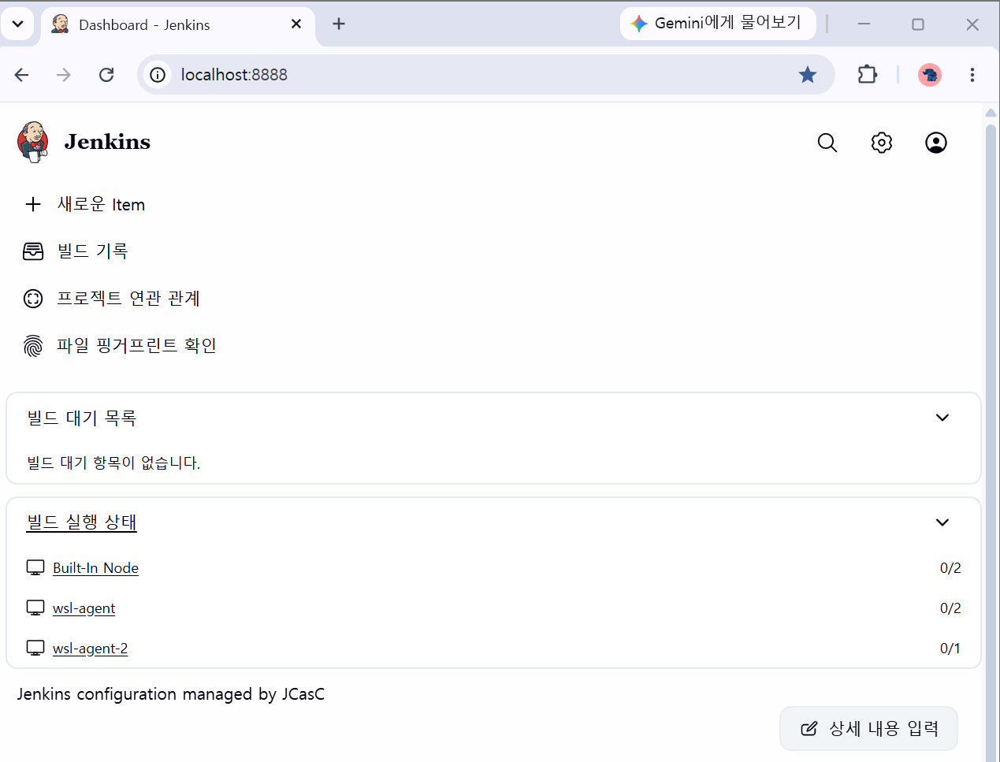
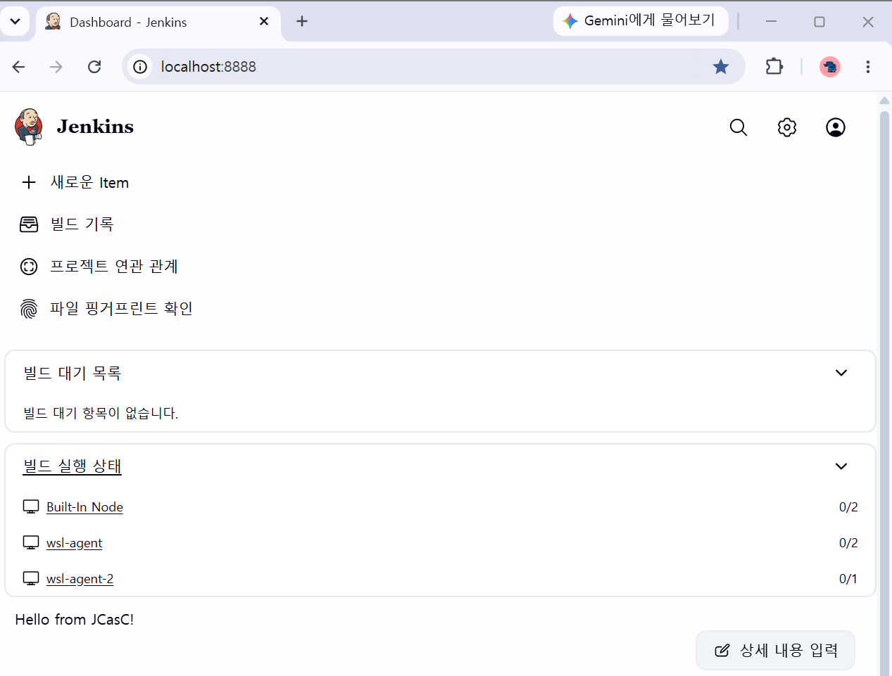

## 2. Configuration as Code (JCasC)

### 2-1) JCasC를 활용한 Controller 설정을 YAML로 관리

- JCasC는 Jenkins 설정을 YAML 파일로 관리하는 것이다.
- UI에서 하던 파일 편집 및 적용을 통해서 매개변수와 값을 설정할 수 있다.
  - Jenkins Controller의 설정은 CasC 또는 UI 중 하나를 사용하여 구현해야 한다.

**섹션 구분**

```yaml
jenkins: ...

tool: ...

unclassified: ...

credentials: ...
```

| 섹션           | 설명                                                         |
| -------------- | ------------------------------------------------------------ |
| `jenkins`      | Jenkins의 루트 객체를 정의 (Configure Nodes and Clouds 화면) |
| `tool`         | 도구 설정 (Tools 화면)                                       |
| `unclassified` | 플러그인을 포함한 기타 설정들                                |
| `credentials`  | credentials 설정 (Manage Credentials 화면)                   |

**SCM에 YAML 파일 저장**

- 변경 내역 추적 및 롤백 가능

**파일 수정**

- 기본적인 저장 위치: `$JENKINS_HOME/jenkins.yaml`
- Jenkins에서 Configuration as Code 페이지에서 텍스트 편집기로 편집 실행

```yaml
# JCasC 플러그인에서 사용하는 기본 설정 예

jenkins:
  systemMessage: "Jenkins configured automatically by Jenkins Configuration as Code plugin\n\n"
  globalNodeProperties:
    - envVars:
        env:
          - key: VARIABLE1
            value: foo
          - key: VARIABLE2
            value: bar
  securityRealm:
    ldap:
      configurations:
        - groupMembershipStrategy:
            fromUserRecord:
              attributeName: "memberOf"
          inhibitInferRootDN: false
          rootDN: "dc=acme,dc=org"
          server: "ldaps://ldap.acme.org:1636"

  nodes:
    - permanent:
        name: "static-agent"
        remoteFS: "/home/jenkins"
        launcher:
          inbound:
            workDirSettings:
              disabled: true
              failIfWorkDirIsMissing: false
              internalDir: "remoting"
              workDirPath: "/tmp"

  slaveAgentPort: 50000

tool:
  git:
    installations:
      - name: git
        home: /usr/local/bin/git

credentials:
  system:
    domainCredentials:
      - credentials:
          - basicSSHUserPrivateKey:
              scope: SYSTEM
              id: ssh_with_passphrase_provided
              username: ssh_root
              passphrase: ${SSH_KEY_PASSWORD}
              description: "SSH passphrase with private key file. Private key provided"
              privateKeySource:
                directEntry:
                  privateKey: ${SSH_PRIVATE_KEY}
```

**보안 고려**

- 일부 환경에서 관리자가 권한이 낮은 사용자에게 JCasC 파일에 접근할 수 있는 권한을 부여하기도 한다. (예: 해당 사용자가 접근할 수 있는 SCM 저장소에 파일 저장 등)
- 관리자가 아닌 사용자에게 파일 편집을 허용하면 보안 위험이 생길 수 있으니 주의해야 한다.
  - 보안 영역/권한 설정 부분을 수정하면 사용자가 의도한 것보다 더 높은 권한을 가질 수도 있다.
  - 보호되지 않은 파트에 secret key를 삽입해뒀다면 민감한 데이터가 노출될 수도 있다.

### 2-2) 플러그인, 계정, Global Tools, Credentials 자동 프로비저닝

**JCasC와 플러그인**

- JCasC는 이미 설치된 플러그인을 설정하는 도구이며, 플러그인 자체 설치는 JCasC 초기화 전에 외부 도구로 수행해야 한다.

**JCasC와 계정**

```yaml
jenkins:
  authorizationStrategy:
    globalMatrix:
      entries:
        - user:
            name: "admin"
            permissions:
              - "Overall/Administer"
        - user:
            name: "anonymous"
            permissions:
              - "Overall/Read"
              - "Job/Read"
        - group:
            name: "authenticated"
            permissions:
              - "Overall/Read"
              - "Job/Build"
              - "Job/Create"
```

Matrix Authorization으로 권한을 개별적으로 구성할 수 있다.

- **권한 상속**: 기본 동작
- **전역 구성만 상속**: 전역적으로 부여된 권한만 상속
- **권한 상속 안 함**: 가장 제한적인 권한 상속

**JCasC와 Credentials**

```yaml
credentials:
  system:
    domainCredentials:
      - domain:
          name: "test.com"
          description: "test.com domain"
          specifications:
            - hostnameSpecification:
                includes: "*.test.com"
        credentials:
          - usernamePassword:
              scope: SYSTEM
              id: sudo_password
              username: root
              password: "${SUDO_PASSWORD}"
```

- `credentials` 2.2.0 이상의 버전이 필요하다.
- 모든 값은 `"${SOME_SECRET}"` 비밀 소스 해결 도구를 통해 해결된다.
- `base64`, `readFileBase64`는 JCasC 버전 v1.42부터 변수 확장을 지원한다.

### 2-3) JCasC 실습

**1단계) JCasC 플러그인 설치**

```jsx
Manage Jenkins
→ Plugins
→ Available plugins
→ Configuration as Code

# 설치 후 재시작
sudo systemctl restart jenkins
```

**2단계) YAML 파일 만들기**

```jsx
soso@DESKTOP-JM4DKDH:~/jenkins-study$ sudo mkdir -p /var/lib/jenkins/casc
soso@DESKTOP-JM4DKDH:~/jenkins-study$ sudo nano /var/lib/jenkins/casc/jenkins.yaml

jenkins:
  systemMessage: "Jenkins configuration managed by JCasC"
```

- `/var/lib/jenkins` → Jenkins의 `JENKINS_HOME`
- `/var/lib/jenkins/casc` → JCasC 설정 파일을 별도로 관리하기 위한 디렉터리

**3단계) Jenkins에게 JCasC 파일 위치 알려주기**

```jsx
soso@DESKTOP-JM4DKDH:~/jenkins-study$ sudo systemctl edit jenkins

[Service]
Environment="JENKINS_PORT=8888"
Environment="CASC_JENKINS_CONFIG=/var/lib/jenkins/casc/jenkins.yaml"

Successfully installed edited file '/etc/systemd/system/jenkins.service.d/override.conf'.
soso@DESKTOP-JM4DKDH:~/jenkins-study$ sudo systemctl daemon-reload
soso@DESKTOP-JM4DKDH:~/jenkins-study$ sudo systemctl restart jenkins
```

- `CASC_JENKINS_CONFIG` 환경 변수로 Jenkins가 어떤 YAML 파일을 JCasC 설정으로 사용할지 지정한다.
  ```jsx
  CASC_JENKINS_CONFIG
          ↓
  /var/lib/jenkins/casc/jenkins.yaml
          ↓
  Jenkins가 YAML 설정 읽음
          ↓
  Jenkins 설정에 반영
  ```

**4단계) Jenkins UI에서 확인하기**



**5단계) YAML 수정하기**

```jsx
soso@DESKTOP-JM4DKDH:~/jenkins-study$ sudo nano /var/lib/jenkins/casc/jenkins.yaml

jenkins:
  systemMessage: "Hello from JCasC!"

soso@DESKTOP-JM4DKDH:~/jenkins-study$ sudo systemctl restart jenkins
```



- `jenkins:` → Jenkins 자체에 대한 설정
- `systemMessage:` → Jenkins UI에 표시할 System Message
- `"Hello from JCasC!"` → 실제 설정값
  → 즉, Jenkins UI에서 직접 System Message를 변경하는 대신 YAML에 원하는 값을 선언한 것이다.

**실습 정리**

- UI : Jenkins UI → 설정 변경 → Jenkins 내부 설정
- JCasC : jenkins.yaml → JCasC → Jenkins 설정

### 2-4) 참고 문헌

- https://www.jenkins.io/doc/book/managing/casc/
- https://github.com/jenkinsci/configuration-as-code-plugin
