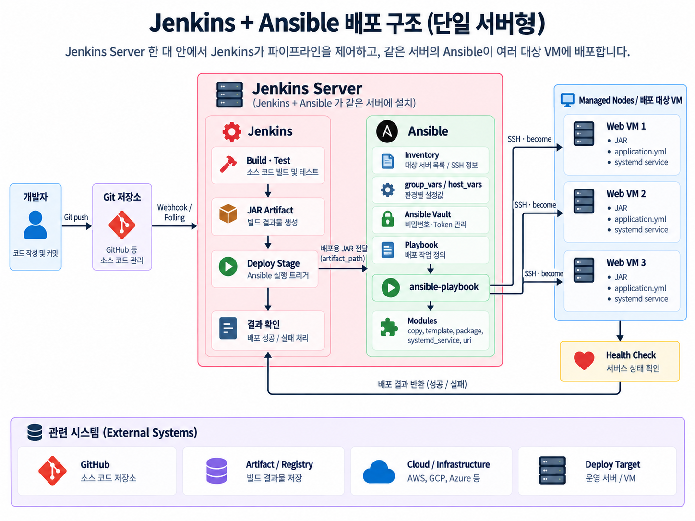

# Week 4 — Architecture & Connection Management

## Ansible이란

Ansible은 원격 시스템의 구성과 관리를 자동화하는 오픈소스 도구다. 명령을 순서대로 실행하는 데 그치지 않고, 시스템이 최종적으로 어떤 상태여야 하는지를 선언하고 그 상태를 유지하도록 한다.

```text
Control node
├── Ansible
├── Inventory
└── Playbook
        │
        │ SSH
        ▼
Managed node
```

현재 실습 환경에서는 Mac이 Control node, 가비아 VM이 Managed node가 된다.

---

## Control node와 Managed node

### Control node

`ansible`, `ansible-playbook`, `ansible-inventory`, `ansible-vault`와 같은 Ansible CLI를 실행하는 시스템이다. Inventory, Playbook, SSH Key도 일반적으로 Control node에서 관리한다.

```bash
ansible --version
ansible-inventory -i inventory.ini --graph
ansible web -i inventory.ini -m ansible.builtin.ping
ansible-playbook -i inventory.ini site.yml
```

### Managed node

Ansible이 관리하는 서버나 네트워크 장비로 `host`라고도 한다. 일반적으로 Managed node에는 Ansible을 설치하지 않는다. Control node가 SSH로 접속해 필요한 Module을 전송하고 실행한다.

Linux에서 대부분의 Module을 사용하려면 Managed node에 Python이 필요하다. Python 설치 전에도 `ansible.builtin.raw`처럼 Python을 요구하지 않는 일부 Module은 사용할 수 있다.

---

## Agentless Architecture

Ansible은 Managed node에 전용 Agent를 상시 설치하지 않고 기존 SSH와 운영체제 계정을 활용한다.

```text
Mac
├── SSH ── web01
├── SSH ── web02
└── SSH ── db01
```

Agent의 설치, 업데이트, 프로세스 감시가 필요하지 않아 관리 부담이 작다. 다만 Agentless가 아무런 준비도 필요 없다는 뜻은 아니다.

- Control node에서 Managed node로 연결할 수 있어야 한다.
- SSH 계정과 인증 수단이 필요하다.
- 작업에 따라 Python과 `sudo` 권한이 필요하다.
- 방화벽과 보안 그룹에서 SSH 연결이 허용되어야 한다.

---

## SSH 연결과 Key 인증

Ansible을 사용하기 전에 일반 SSH 접속부터 확인해야 한다.

```bash
ssh -i ~/.ssh/gabia_ed25519 ubuntu@203.0.113.10
```

직접 접속이 성공한 뒤 Inventory에 같은 정보를 작성한다.

```ini
[web]
gabia-web ansible_host=203.0.113.10

[web:vars]
ansible_user=ubuntu
ansible_ssh_private_key_file=~/.ssh/gabia_ed25519
```

```bash
ansible web -i inventory.ini -m ansible.builtin.ping
```

`ansible.builtin.ping`은 ICMP ping이 아니다. Ansible이 SSH로 연결하고 대상에서 Python 기반 Module을 실행한 뒤 `pong`을 반환할 수 있는지 확인한다.

Playbook이 Inventory를 직접 읽는 것은 아니다. `ansible-playbook` 명령이 `-i`로 지정한 Inventory와 Playbook을 함께 읽고, Playbook의 `hosts`와 같은 이름의 Inventory Host 또는 Group을 연결한다.

```text
Inventory → 어디에, 어떤 계정과 연결 방식으로 접속할지
Playbook  → 접속한 대상에서 어떤 작업을 실행할지
```

### 주요 연결 변수

| 변수 | 의미 |
|---|---|
| `ansible_host` | 실제 IP 또는 도메인 |
| `ansible_port` | SSH 포트, 기본값은 22 |
| `ansible_user` | SSH 접속 사용자 |
| `ansible_connection` | 연결 Plugin, Linux의 기본값은 `ssh` |
| `ansible_ssh_private_key_file` | 사용할 Private Key 경로 |
| `ansible_ssh_common_args` | 모든 SSH 명령에 추가할 옵션 |
| `ansible_python_interpreter` | Managed node에서 사용할 Python 경로 |

Private Key에 암호가 설정되어 있다면 평문으로 암호를 저장하기보다 `ssh-agent`를 사용하는 것이 좋다.

```bash
ssh-add ~/.ssh/gabia_ed25519
ssh-add -l
```

Private Key나 비밀번호는 Git 저장소에 커밋하지 않는다. 비밀번호 형태의 민감한 변수가 꼭 필요하면 Ansible Vault로 암호화한다.

### 실습: SSH Key부터 Ansible Ping까지

Control node에서 ED25519 Key Pair를 생성하고 공개키만 서버 관리자에게 전달했다.

```bash
ssh-keygen -t ed25519
```

```text
~/.ssh/id_ed25519      → Private Key, 외부 전달 금지
~/.ssh/id_ed25519.pub  → Public Key, Managed node에 등록
```

Ansible을 실행하기 전에 같은 계정과 Key로 Managed node에 직접 접속했다.

```bash
ssh -i ~/.ssh/id_ed25519 doyeon@<VM_PUBLIC_IP>
```

`whoami`, `hostname`, `python3 --version`, `sudo -l`을 실행해 `doyeon` 계정, Ubuntu 24.04 LTS, Python, `NOPASSWD` sudo 권한을 확인했다.

실제 IP가 들어간 `inventory.local.ini`는 Git에서 제외하고 공유용 파일에는 placeholder만 작성했다.

```ini
[web]
vm01 ansible_host=<VM_PUBLIC_IP>

[web:vars]
ansible_user=doyeon
ansible_ssh_private_key_file=~/.ssh/id_ed25519
```

```bash
ansible-inventory -i inventory.local.ini --graph
```

Private Key에 passphrase가 있어 첫 Ansible 연결은 `Permission denied`로 실패했다. 일반 SSH와 달리 Ansible의 비대화식 연결에서는 passphrase를 직접 입력하지 못하기 때문이다. Key를 SSH Agent에 등록한 뒤 다시 실행했다.

```bash
ssh-add ~/.ssh/id_ed25519
ssh-add -l

ansible web -i inventory.local.ini \
  -m ansible.builtin.ping
```

SSH Agent는 Private Key를 서버에 전달하지 않고 Control node에서 인증용 서명을 수행한다. macOS Keychain에도 passphrase를 저장하려면 다음 옵션을 사용할 수 있다.

```bash
ssh-add --apple-use-keychain ~/.ssh/id_ed25519
```

재실행 결과 `pong`을 확인했으며 Managed node의 `/usr/bin/python3.12`가 자동으로 선택되었다.

---

## 권한 상승: `become`

SSH 접속 사용자와 관리 작업을 수행할 사용자는 다를 수 있다. 일반 사용자로 접속한 뒤 패키지 설치나 시스템 파일 수정에만 `sudo` 권한을 사용하는 것이 `become`이다.

```yaml
---
- name: Configure web servers
  hosts: web
  become: true

  tasks:
    - name: Ensure Nginx is installed
      ansible.builtin.package:
        name: nginx
        state: present
```

- `become: true`: 권한 상승 사용
- `become_user`: 권한 상승 후 작업을 실행할 사용자, 기본값은 보통 `root`
- `become_method`: `sudo`, `su` 등 권한 상승 방식

특정 Task에만 적용할 수도 있다.

```yaml
- name: Read application file as app user
  ansible.builtin.command:
    cmd: id
  become: true
  become_user: app
  changed_when: false
```

`sudo`가 비밀번호를 요구한다면 실행 시 물어보도록 할 수 있다.

```bash
ansible-playbook -i inventory.ini site.yml --ask-become-pass
```

`ansible_become_password`를 Inventory에 평문으로 저장하지 않는다.

### 실습: 일반 사용자와 `become` 비교

같은 명령을 일반 권한과 권한 상승 상태로 각각 실행했다.

```bash
ansible web -i inventory.local.ini \
  -m ansible.builtin.command -a "whoami"

ansible web -i inventory.local.ini \
  --become \
  -m ansible.builtin.command -a "whoami"
```

```text
일반 실행   → doyeon
become 실행 → root
```

동일한 확인을 `verify-connection.yml` Playbook으로 실행했다. 조회 Task에 `changed_when: false`를 지정해 실제 변경이 없음을 표현했다.

```text
ok=6  changed=0  unreachable=0  failed=0
```

---

## Connection Plugin

Plugin은 Ansible Core의 동작을 확장한다. Connection Plugin은 Control node가 Managed node와 통신하는 방법을 결정한다.

| Connection | 사용 예 |
|---|---|
| `ssh` | 일반 Linux/Unix 서버 |
| `local` | Control node 자체에서 실행 |
| `winrm` | Windows 원격 관리 |
| `network_cli` | 네트워크 장비 CLI |

```ini
[local]
localhost ansible_connection=local
```

```bash
ansible-doc -t connection ssh
```

일반 Linux 서버에서는 기본 OpenSSH 기반 `ssh` Plugin을 사용한다. OpenSSH 설정의 `ControlPersist`와 `~/.ssh/config`도 활용할 수 있다.

`local`은 로컬 VM이라는 뜻이 아니라 **현재 Ansible이 실행되는 Control node 자체**를 의미한다. Mac에서 Ansible을 실행하면 Mac이 대상이고, 컨테이너나 VM 안에서 Ansible을 실행하면 해당 실행 환경이 대상이 된다.

### 실습: `ssh`와 `local` Connection 비교

가비아 VM에는 기본 `ssh` Connection으로 연결했고, Control node 자체에는 `local` Connection으로 Module을 실행했다.

```bash
ansible localhost -i 'localhost,' \
  --connection local \
  -m ansible.builtin.ping
```

```text
ssh Connection   → Control node에서 원격 Managed node에 실행
local Connection → Control node 자체에서 실행
```

---

## Bastion과 Jump Host

Managed node가 사설 네트워크에 있어 직접 연결할 수 없다면 외부에서 접근 가능한 Bastion을 경유한다.

```text
Control node
     │
     │ SSH
     ▼
Bastion / Jump Host
     │
     │ SSH
     ▼
Private Managed node
```

먼저 일반 SSH로 경유 연결을 확인한다.

```bash
ssh -J ubuntu@198.51.100.10 ubuntu@10.0.1.20
```

`-J`는 OpenSSH의 `ProxyJump` 옵션이다. Bastion에 직접 로그인한 뒤 다시 SSH 명령을 입력하는 대신, SSH 클라이언트가 Bastion을 중간 통로로 사용해 목적지까지 연결한다. Bastion은 모든 네트워크 트래픽의 기본 Gateway라기보다 관리용 SSH 접근을 중계하는 보안 관문에 가깝다.

Inventory에서는 `ansible_ssh_common_args`에 `ProxyJump`를 지정할 수 있다.

```ini
[private_web]
web01 ansible_host=10.0.1.20

[private_web:vars]
ansible_user=ubuntu
ansible_ssh_common_args='-o ProxyJump=ubuntu@198.51.100.10'
```

서버가 많다면 `~/.ssh/config`에 연결 방식을 정의하고 Ansible이 그 설정을 재사용하게 할 수도 있다.

```sshconfig
Host bastion
  HostName 198.51.100.10
  User ubuntu

Host 10.0.*
  User ubuntu
  ProxyJump bastion
```

---

## 연결 확인 순서

```text
1. 일반 SSH 접속 확인
2. Inventory 문법과 대상 확인
3. Ansible ping 실행
4. 일반 사용자 권한으로 명령 실행
5. become을 사용하는 관리 작업 확인
```

```bash
ssh ubuntu@203.0.113.10
ansible-inventory -i inventory.ini --graph
ansible web -i inventory.ini -m ansible.builtin.ping
ansible web -i inventory.ini -m ansible.builtin.command -a "id"
ansible web -i inventory.ini -b -m ansible.builtin.command -a "id"
```

SSH 연결 실패와 Ansible 실행 실패를 구분하기 위해 항상 일반 SSH부터 확인한다.

---

## Jenkins와 연결할 때의 실습 구조

앞으로 Jenkins와 Ansible을 연결하는 첫 실습에는 **Jenkins와 Ansible을 같은 서버에 설치하는 단일 서버형 구조**를 사용한다.



이 구조에서 Jenkins Server는 두 가지 역할을 함께 맡는다.

- Jenkins가 소스 코드를 빌드·테스트하고 JAR Artifact를 만든다.
- 같은 서버에 설치된 Ansible이 Control Node가 되어 Inventory와 Playbook을 읽고 Managed Node에 배포한다.

```text
개발자 → Git 저장소 → Jenkins Server
                            ├─ Build / Test / JAR 생성
                            └─ ansible-playbook 실행
                                      │
                                      │ SSH + become
                                      ▼
                             배포 대상 VM 여러 대
```

현재 Mac에서 직접 실행하는 `ansible-playbook`을 나중에는 Jenkins Pipeline의 Deploy Stage가 대신 실행한다고 이해하면 된다. Jenkins 작업 공간에 체크아웃된 저장소 안에서 Inventory, 변수 파일, Playbook을 읽으며, 빌드된 JAR 경로를 변수로 전달해 각 VM에 복사하고 서비스를 재시작한 뒤 Health Check 결과를 Jenkins에 반환한다.

이 구조를 먼저 사용하는 이유는 다음과 같다.

- 별도의 Jenkins Agent를 구축하지 않아도 Jenkins와 Ansible의 연결 흐름을 학습할 수 있다.
- Jenkins가 만든 Artifact와 Ansible이 배포할 파일이 같은 작업 공간에 있어 경로 전달이 단순하다.
- 서버와 설정이 적어 빌드 실패와 배포 실패를 구분하며 실습하기 쉽다.

SSH Private Key, Vault 비밀번호 같은 비밀값은 Git 저장소에 넣지 않는다. Jenkins Credentials에 저장한 뒤 Pipeline 실행 중에만 Ansible이 사용하도록 전달한다. 암호화할 변수 파일은 Ansible Vault로 관리하되, Vault를 여는 비밀번호 자체는 Jenkins Credentials에서 관리한다.

단일 서버형은 학습과 소규모 환경에는 단순하지만, Jenkins Controller에 빌드와 배포 부하가 함께 집중되고 배포 권한도 모이는 한계가 있다. 대상과 Pipeline이 많아지면 첫 번째 이미지처럼 별도의 Jenkins Agent를 Ansible Control Node로 두는 구조로 분리할 수 있다. 즉, 두 구조는 서로 다른 방식이라기보다 다음과 같은 발전 단계에 가깝다.

```text
초기 실습
Jenkins Server = Jenkins 실행 환경 + Ansible Control Node

확장 환경
Jenkins Controller = Pipeline 제어
Jenkins Agent      = 빌드 및 Ansible 실행
```

---

## 핵심 정리

```text
Control node
→ Ansible, Inventory, Playbook, Private Key를 보관하고 실행

Managed node
→ Ansible이 SSH로 연결해 Module을 실행하는 관리 대상

ssh Connection
→ 원격 Linux 서버에서 실행

local Connection
→ Ansible이 실행 중인 Control node 자체에서 실행

become
→ 일반 계정으로 접속한 뒤 필요한 Task에서만 권한 상승

ProxyJump
→ Bastion을 중간 통로로 사용해 Private 서버에 SSH 연결
```

Inventory의 여러 Host와 Group, 연결 변수와 일반 변수, `group_vars`와 `host_vars`는 다음 문서에서 다룬다.

---

## 참고 자료

- [Introduction to Ansible](https://docs.ansible.com/projects/ansible/latest/getting_started/introduction.html)
- [Ansible concepts](https://docs.ansible.com/projects/ansible/latest/getting_started/basic_concepts.html)
- [Connection methods and details](https://docs.ansible.com/projects/ansible/latest/inventory_guide/connection_details.html)
- [Understanding privilege escalation](https://docs.ansible.com/projects/ansible/latest/playbook_guide/playbooks_privilege_escalation.html)
- [Connection plugins](https://docs.ansible.com/projects/ansible/latest/plugins/connection.html)
